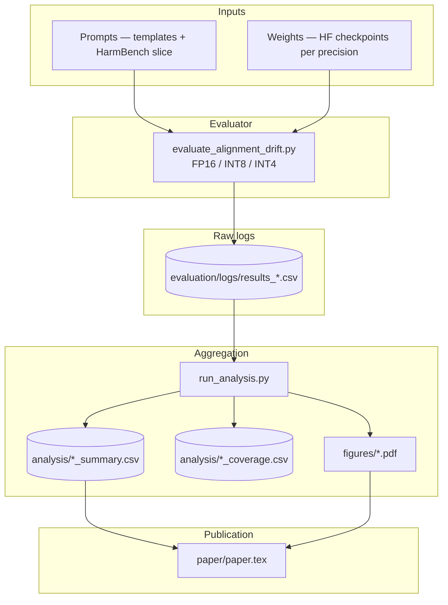

<div align="center">

# Alignment-Drift-Benchmark (ADB)

**Measure how weight precision (FP16 → INT8 → INT4) moves refusal behavior—separately from headline accuracy.**

[](https://github.com/IcySpicy21/Alignment-Drift-Benchmark_ADB)
[](https://github.com/IcySpicy21/Alignment-Drift-Benchmark_ADB/stargazers)
[](https://www.python.org/)
[](https://pytorch.org/)
[](https://huggingface.co/)
[](paper/paper.tex)

</div>

---

## Problem

Teams compress instruction-tuned LLMs to cut **memory and latency**, but most public benchmarks still optimize for **perplexity and task accuracy**. **Safety alignment**—who gets refused and when—can move under post-training quantization (PTQ) even when MMLU-style scores look fine. Without a **repeatable harness**, that drift is easy to miss until production traffic hits edge cases (jailbreak slices, over-refusal, uneven category behavior).

**ADB closes the loop:** same prompts, same judge rubric, different bit-widths—so refusal telemetry is **comparable across FP16, INT8, and INT4** on the checkpoints you actually ship.

---

## Solution

ADB is a **small evaluation + analysis pipeline** built for IIT Roorkee research on quantization and alignment drift:

| Piece | Role |
|--------|------|
| **Prompt matrix** | In-house templates plus HarmBench-derived rows for out-of-distribution stress. |
| **Precision sweep** | FP16 baseline, INT8, INT4 (e.g. `bitsandbytes` NF4) on the same Hugging Face model IDs. |
| **LLM judge** | Automated refusal vs compliance labels (e.g. `Llama-3-70B`) instead of brittle regex-only baselines. |
| **Artifacts** | Per-run CSV logs, rolled-up summaries, plots, and a path to the LaTeX manuscript. |

You get **CSV truth** you can diff in CI, not a one-off notebook snapshot.

---

## Architecture

End-to-end flow from prompts to paper-ready figures:



**Coverage CSVs** record whether each `(model, precision)` cell is `computed`, `skipped`, or `not_applicable`—so incomplete matrices are obvious before you cite a number.

---

## Demo command

From the **repository root** (after [Hugging Face](https://huggingface.co/) access is sorted for gated models):

```bash
python -m pip install -r requirements.txt

# Single precision slice (default model list in script; override with --models)
python evaluation/evaluate_alignment_drift.py --precision fp16
python evaluation/evaluate_alignment_drift.py --precision int8
python evaluation/evaluate_alignment_drift.py --precision int4

# Roll up logs → summaries + figures
python analysis/run_analysis.py
```

**GPTQ** on a host where `auto-gptq` is painful:

```bash
bash scripts/run_gptq_docker.sh
```

**Multi-seed matrix** (longer runs):

```bash
bash scripts/run_v2_matrix.sh && python analysis/run_analysis.py
```

Dry run (cap prompts): `MAX_PROMPTS=5 bash scripts/run_v2_matrix.sh` · Mistral-only smoke: `bash scripts/run_mistral_fast_slice.sh`

---

## Results

| Output | Location |
|--------|----------|
| Per-run generations + metadata | `evaluation/logs/results_*.csv` |
| Refusal / drift / margin summaries | `analysis/refusal_summary.csv`, `drift_summary.csv`, `margin_summary.csv` |
| Completeness audit | `analysis/refusal_coverage.csv`, `drift_coverage.csv`, `margin_coverage.csv` |
| Plots | `figures/` (e.g. heatmap, violin, safety–utility overlay—see `paper/paper.tex`) |
| Frozen numeric scratchpad | `paper/results_headline_summary.txt` |
| Manuscript | `paper/paper.tex` · arXiv bundle: `bash scripts/package_arxiv.sh` → `paper/arxiv_submission/arxiv_source.tar.gz` |

**Headline snapshot** (v1 three-model refresh; exploratory—see paper for FDR and limits): Mistral-7B shows the largest **INT8→INT4 refusal step** among the trio; Gemma tops **absolute** refusal rate in that snapshot. Full decimals live in `paper/results_headline_summary.txt`.

---

## Why this matters

- **For recruiters / hiring managers:** Shows end-to-end ownership—**experiment design**, **GPU evaluation**, **statistical reporting**, and **reproducible tooling** around a timely topic (efficient LLM deployment + safety).
- **For production ML:** Treats **INT4** as a release candidate: same red-team discipline you would apply after a finetune, backed by **logs you can archive and diff**.
- **For research:** Separates **capability decay** (e.g. MMLU/GSM8K controls in the paper) from **refusal drift**, and documents **multiplicity correction** so claims stay honest.

---

### Reference (quick facts)

- **Drift rows** only exist for quantized precisions; FP16 is the implicit baseline (`fp16` drift = `not_applicable` in coverage tables).
- **Submission / release checklist:** `paper/STAGE8_SUBMISSION_VISIBILITY.md`
- **Maintainer path:** this README tracks [`IcySpicy21/Alignment-Drift-Benchmark_ADB`](https://github.com/IcySpicy21/Alignment-Drift-Benchmark_ADB); cite the artifact entry in `paper/references.bib` when pointing readers to code from the PDF.

---

## License

**All rights reserved.** See [`LICENSE`](LICENSE).
